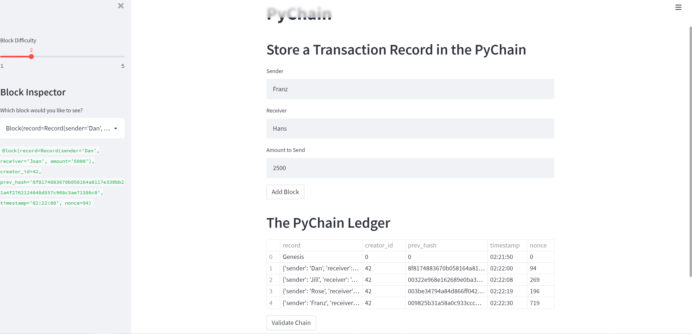
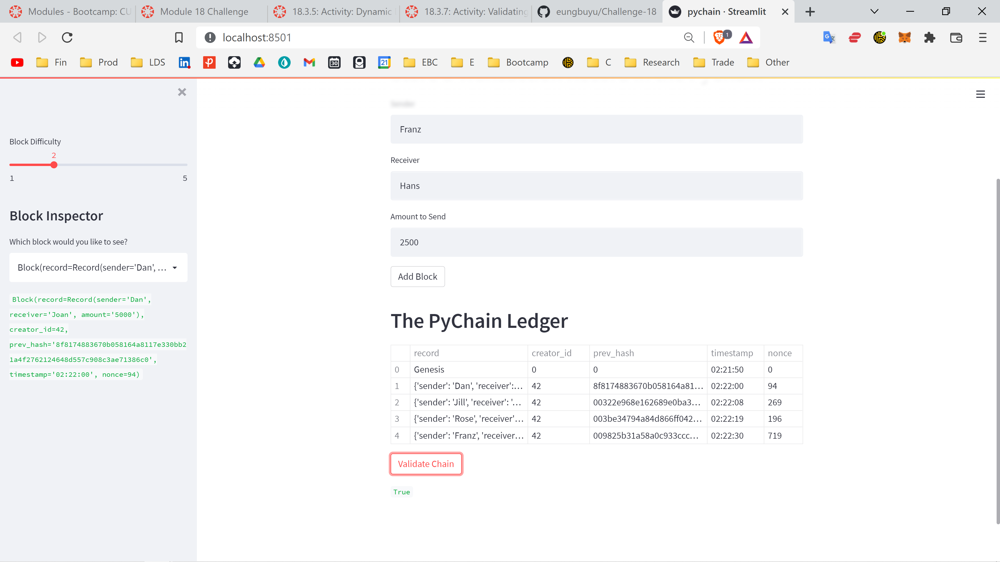

# Challenge 18 - PyChain Ledger
This is a blockchain-based ledger system with a user-friendly web interface. It allows partner banks to transfer money between senders and receivers, and to verify the integrity of the data in the ledger.

---
## Technologies
PyChain Ledger uses the following Python 3.7 libraries:
### **streamlit** - for building the user-friendly web interface.
### **dataclasses** - for use of the *dataclass* tool in building custom classes.
### **typing** - for use of the *Any* and *List* tools in defining attributes' datatypes and building lists (the chain).
### **datetime** - for the *datetime* tool in defining the timestamp of the blocks.
### **pandas** - for financial analysis.
### **hashlib** - for creating hashes for each block.
```python
import streamlit as st
from dataclasses import dataclass
from typing import Any, List
import datetime as datetime
import pandas as pd
import hashlib
```
---
## Installation Guide
First, install the following on the **dev** environment, or whichever environment you would like to install **streamlit** on. Activate the environment in GitBash or Terminal, and run the following:
```
pip install streamlit
```
Then, navigate to the folder that contains this PyChain.py file in GitBash or Terminal for Mac. Run the following:
```
streamlit run pychain.py
```
It will open the user interface in a new window on your browser.

---
## Usage
You can add as many blocks as you need by filling in the sender (name or id; it is a string), receiver (name or id), and amount (float) and clicking "Add Block".
You will see **The PyChain Ledger** on the bottom grow as you add more blocks, with the **Block Inspector** to the left giving you a dropdown bar where you can examine each block in greater detail.

You can verify the integrity of the blockchain by clicking "Validate Chain" under **The PyChain Ledger**. If correct, it will return "True" under the "Validate Chain" button. 


---
## Contributors
Heeje Yoo - heeje90@pm.me

---
## License
Copyright 2022 Heeje Yoo

Permission is hereby granted, free of charge, to any person obtaining a copy of this software and associated documentation files (the "Software"), to deal in the Software without restriction, including without limitation the rights to use, copy, modify, merge, publish, distribute, sublicense, and/or sell copies of the Software, and to permit persons to whom the Software is furnished to do so, subject to the following conditions:

The above copyright notice and this permission notice shall be included in all copies or substantial portions of the Software.

THE SOFTWARE IS PROVIDED "AS IS", WITHOUT WARRANTY OF ANY KIND, EXPRESS OR IMPLIED, INCLUDING BUT NOT LIMITED TO THE WARRANTIES OF MERCHANTABILITY, FITNESS FOR A PARTICULAR PURPOSE AND NONINFRINGEMENT. IN NO EVENT SHALL THE AUTHORS OR COPYRIGHT HOLDERS BE LIABLE FOR ANY CLAIM, DAMAGES OR OTHER LIABILITY, WHETHER IN AN ACTION OF CONTRACT, TORT OR OTHERWISE, ARISING FROM, OUT OF OR IN CONNECTION WITH THE SOFTWARE OR THE USE OR OTHER DEALINGS IN THE SOFTWARE.